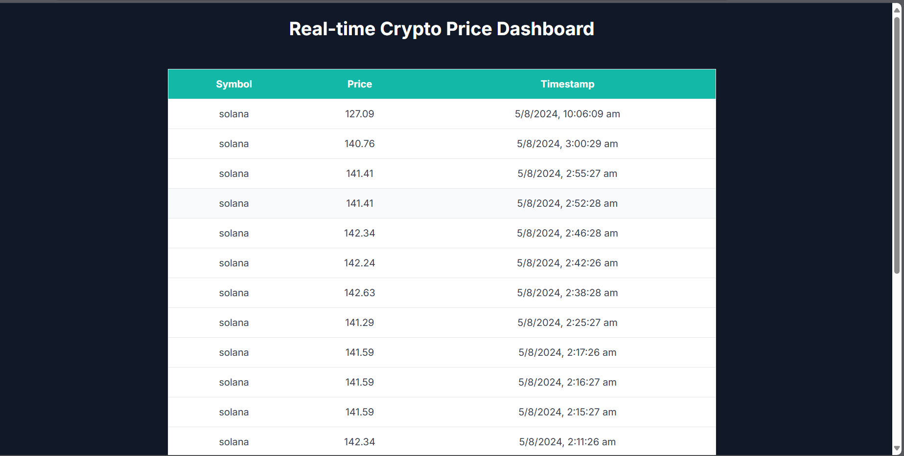
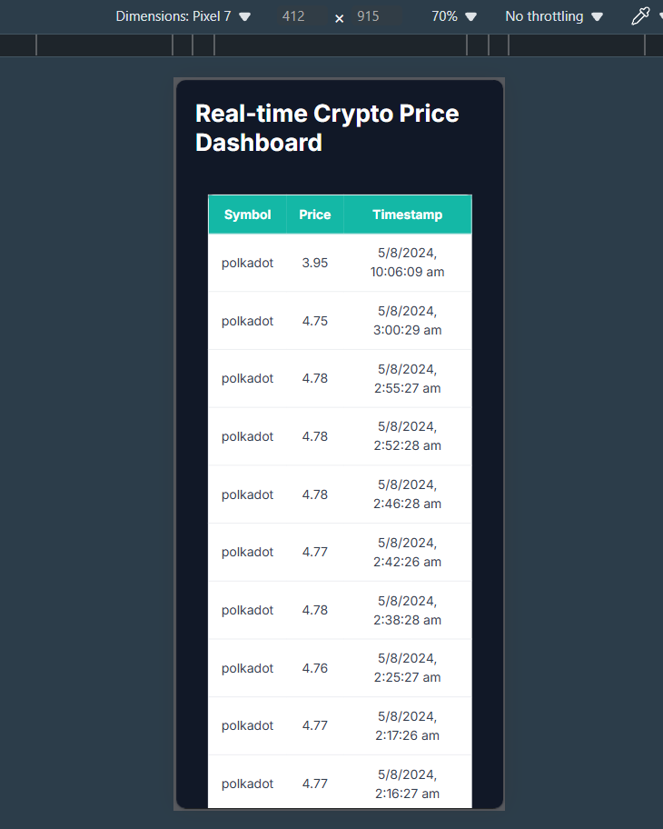
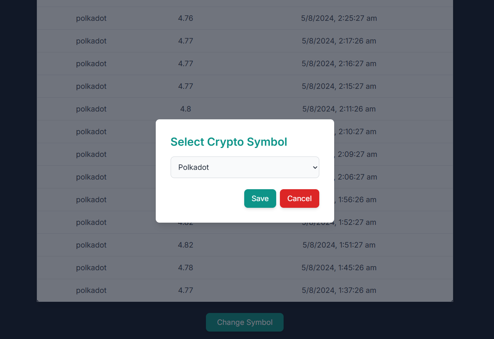
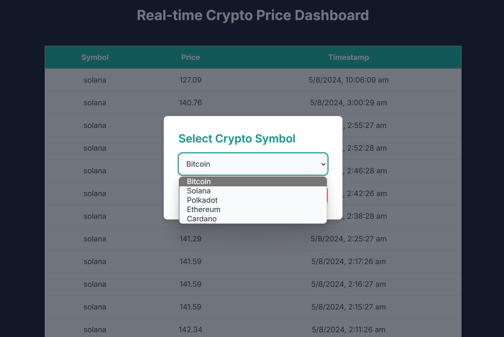

# Crypto Price Dashboard - Frontend

This project is a frontend application for displaying real-time cryptocurrency prices. It is built using Next.js, TypeScript, Redux, and Tailwind CSS.






## Features

- Real-time cryptocurrency price updates
- Responsive design with Tailwind CSS
- Modal for changing cryptocurrency symbols
- State management with Redux
- Local storage for persistent state

## Prerequisites

- Node.js (>=14.x)
- npm or yarn

## Installation

1. Clone the repository:
    ```bash
    git clone https://github.com/Rushikesh-Gavali/Crypto-App.git
    cd crypto_app_frontend
    ```

2. Install dependencies:
    ```bash
    npm install
    # or
    yarn install
    ```

3. Create a `.env` file in the root directory and add necessary environment variables:
    ```env
    NEXT_PUBLIC_API_URL=http://localhost:5000/api
    ```

## Running the Application

1. Start the development server:
    ```bash
    npm run dev
    # or
    yarn dev
    ```

2. Open your browser and navigate to `http://localhost:3000`.


# Crypto Price Dashboard - Backend

This project is the backend service for the Crypto Price Dashboard. It is built using Node.js, Express, and MongoDB.


## Features

- Fetches real-time cryptocurrency prices from an external API
- Stores cryptocurrency prices in MongoDB
- Provides API endpoints to retrieve cryptocurrency prices
- Handles errors and responses properly

## Prerequisites

- Node.js (>=14.x)
- npm or yarn
- MongoDB

## Installation

1. Clone the repository:
    ```bash
    git clone https://github.com/Rushikesh-Gavali/Crypto-App.git
    cd crypto_app_backend
    ```

2. Install dependencies:
    ```bash
    npm install
    # or
    yarn install
    ```

3. Create a `.env` file in the root directory and add necessary environment variables:
    ```env
    PORT=5000
    MONGODB_URI=mongodb://localhost:27017/crypto
    PORT=5000
    ```

## Running the Application

1. Start the server:
    ```bash
    npm start
    # or
    yarn start
    ```

2. The backend server will run on `http://localhost:5000`.

## Folder Structure


